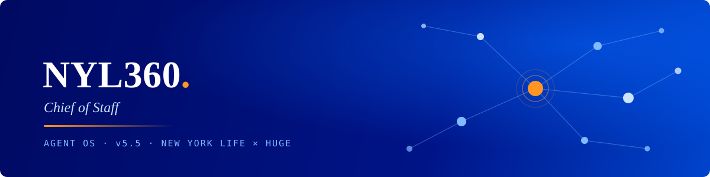
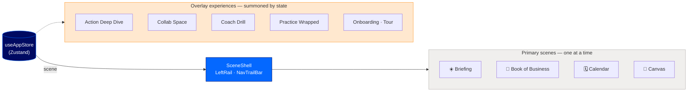

<p align="center">
  
</p>

<p align="center">
  
  
  
  
  
  
  
</p>

# NYL360 — Chief of Staff

An interactive prototype of an **agent operating system** for New York Life advisors: a morning briefing, a living book of business, and an AI chief of staff that turns client signals into next actions. Built by [Huge](https://www.hugeinc.com) as a scene-based React app — no backend, all narrative.

> 🔗 **Live preview:** [agent-os-v5-5 on Vercel](https://agent-os-v5-5-evienna-2363-huge-inc-sandbox.vercel.app) *(password-gated)*

---

## How it works

One Zustand store drives everything. `scene` selects the primary view; overlay experiences (deep dives, collab space, onboarding, coach drills) are always mounted and reveal themselves from their own slices of state. Scene transitions animate through Motion's `AnimatePresence`.



## Scene guide

| Scene | File | What it does |
|---|---|---|
| ☀️ **Briefing** | `BriefingV55Scene` | The morning briefing — today's signals, narrated |
| 📒 **Book of Business** | `ActionBoardScene` · `MyBookCanvas` | Clients and prospects as a living action board |
| 🎯 **Destinations** | `DestinationScene` | Actives and prospects pipelines |
| 📈 **Business** | `BusinessScene` | Practice-level metrics |
| 🗓 **Calendar** | `CalendarScene` | The week, with prep woven in |
| 🧠 **Canvas** | `CanvasScene` · `FreeformScene` · `SignalsCanvas` | Freeform thinking surfaces |
| 🔍 **Action Deep Dive** | `ActionDeepDive` | Drill into a single recommended action |
| 🤝 **Collab Space** | `CollabSpace` | Working session with the AI chief of staff |
| 🏋️ **Coach Drill** | `CoachDrill` | Practice conversations before the real one |
| 🎁 **Practice Wrapped** | `PracticeWrapped` | Year-in-review, Spotify-Wrapped style |
| 👋 **Onboarding** | `OnboardingFlow` · `LandingChooser` · `QuickStartTour` | First-run flows and guided tour |

## Getting started

```bash
npm install
npm run dev      # vite dev server
npm run build    # tsc -b && vite build — strict, unused vars fail the build
npm run lint
```

## Project structure

```
src/
├── App.tsx              # scene router (AnimatePresence)
├── state/useAppStore.ts # the one store
├── scenes/              # primary scenes + overlay experiences
├── components/          # SceneShell, LeftRail, NavTrailBar, Typewriter…
├── data/                # briefing + advisor narrative content
├── styles/tokens.css    # NYL token layer: primitives → semantics → theme
└── ui/                  # brand atoms (NYLLogo)
```

## Design system

- **Tokens first** — touch `src/styles/tokens.css`, not component styles. Primitives → semantics → theme, with the raw JSON preserved in `src/styles/tokens/`.
- **Type** — [Alverata](https://fonts.adobe.com/fonts/alverata) (serif, via Adobe Fonts kit) + Roboto / Roboto Mono.
- **Color** — NYL brand palette: Blue `#0468ff` · Dark Blue `#000a62` · Orange `#ff9522` · Purple `#4d1773`, plus a data-viz ramp mapped to client trigger types.

## Working on this repo

See **[CONTRIBUTING.md](CONTRIBUTING.md)** for full setup — access, SSO, and local dev.

- Clone to a normal folder — **not** a synced directory (Dropbox/iCloud corrupt `.git` and `node_modules`).
- Branch per change → PR into `main`. `main` is protected and always deployable.
- `npm run build` must pass — `tsc -b` is strict and unused vars are errors. **CI enforces this on every PR.**
- Every PR gets an automatic Vercel preview URL; merging to `main` auto-deploys to production.

---

<p align="center">
  <sub>Internal prototype · New York Life × Huge · not for distribution</sub>
</p>
